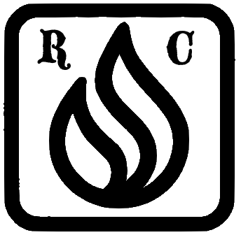

# Welcome to my blog!
#New-Beginnings #Organization

I am a SWE. Have been for 13 years. I help companies take their software needs from conception to fruition, or from broken to functional. I do it in Fort Wayne, Indiana. It's not the easiest place to find software work, but it's getting better. 

I am also a husband and father of two kids. I do that in Ft. Wayne, too. It's not the most exciting place to raise a family, but it's safe and affordable. Hope that stays the same.

I also love ceramics, music, mobile apps, gardening, 3D  modeling, biking, reading(books and comics), and beekeeping. That's a lot of interests for a guy who works 40+ hours/week and loves his family. Couldn't do it without my wife. 

I used to entertain dreams of entering politics and changing the world. The past decade has slowly stifled that dream. Maybe I'll run for local office "eventually" (we all know what that means).

I used to read blogs. Now I read a lot of forum posts. 

What I don't love about forums is the central control--if i say something on reddit that "breaks the rules", my comment can be removed.

Not so, here. 

_____

Current Projects:

- Ceramics
- Learning Bass
- iOS App Development
- Gardening
- Parenting
- Consulting
- 3D Modeling
- Exercise
- Beekeeping
- Reading

I'm realizing that's.. quite a few areas. I'll be able to keep my hands busy for some time.

Here's a maker's mark i've been working on, for my ceramics

The highly stylized stylized flame icon in the center represents the digital part of my creation. I do all my mold making on my computers and 3d printers. 

The R and C stand for "Reusser Ceramics"

I have a dream of one day selling my forms in stores across the nation. 
